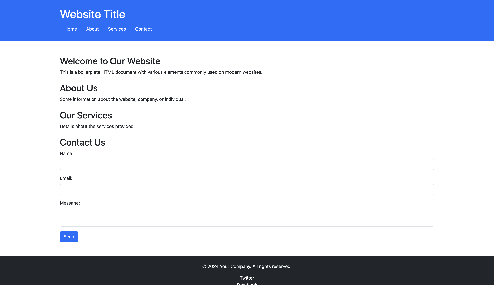

# Basic Example

The following is a `classic` example of how `php` works, as in fact, a `preprocessor`.
<br>
The `.html` below represents a `boilerplate` which encompasses most of the best practices used within modern day `web development`, accounting for things such as `SEO`, and more.
<br>
<br>

---

## Usage

To run the example, run:

```bash
php -S 0.0.0.0:8080
```

This will host a 'server' locally and therefore you may go  to your `web browser` of choice and enter:

```bash
http://localhost:8080/index.php
```

This will show you the barebones structure of the web page, which is quite ugly due to it being so *naked*


In order to make it prettier, `.css` needs to be added, more on `front end` topics will be formally taught in the [Web Programming Course](https://web.dmi.unict.it/corsi/l-31/insegnamenti?seuid=97A11224-2815-4847-AACE-12E5877174D4) held py *Prof. F. Santoro*

---

#### With CSS Version

To run the `pretty` version of the index page, run:

```bash
cd Pretty-Version
php -S 0.0.0.0:8080
```

Search on the browser again:

```bash
http://localhost:8080/index.php
```

And you will find this, slightly, more elegant version of the website



---

## References

- [php tutorials](https://www.w3schools.com/php/default.asp)

---