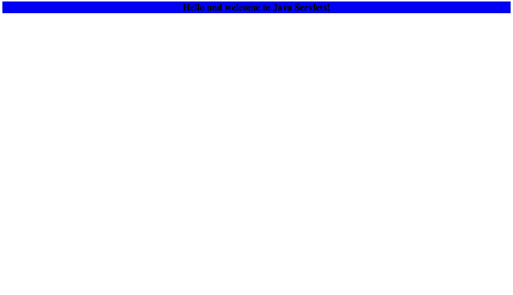

# Java Servlets

A Java `servlet` is a server-side technology used for developing `dynamic web applications` in Java. It runs on the server and handles client requests and generates `dynamic web content` as responses. Servlets are part of the `Java EE (Enterprise Edition)` platform and are deployed on `servlet containers` (e.g., Apache Tomcat, Jetty, and more)

----

## Initializing the project with Apache Maven


Initialize the Servlet project with the appropriate directory structure using the following command: 

```bash
mvn archetype:generate -DgroupId=com.drew -DartifactId=web-app -DarchetypeArtifactId=maven-archetype-webapp -DinteractiveMode=false
```

(Tweak the parameters as needed)

----

## Hosting

There are two options when it comes to 'testing' locally a Java servlet, either by downloading `Apache Tomcat` (version >= 10) and running the servlet locally {Not advisable} or by `containerizing` the Apache Tomcat server with `docker` and uploading the code into the `docker image` and then running the container, this step requires some additional configuration of the `Docker runtime`.
<br>
<br>
The container image can also be built and run using `Apache Maven`, by using the appropriate `pipeline` and `plugins`

A simpler way to deploy a Java Servlet is to `embed` a servlet engine within the app itself using the `eclipse jetty` servlet container (injected as a dependency via the Apache Maven build system)

----

## The Project's Structure

The barebones structure of a `servlet` is:

```bash
web-app
|
├── pom.xml
└── src
```

After running the `mvn clean install`, the entire lifecycle defined in the `pom.xml` will be executed, generating a `target` directory where all the `.class files`, test files and built arficats will be locate

----

## The WEB-INF directory

The directory holds the `web.xml` file which has the definitions of the servlet's `mappings`, in other words it is the configuration file for what would be explicitly programmed in a JavaScript framework such as express.js

Below is the `mapping` for the example servlet:

```bash
<servlet>
    <servlet-name>SimpleServlet</servlet-name>
    <servlet-class>App</servlet-class>
</servlet>
<servlet-mapping>
    <servlet-name>SimpleServlet</servlet-name>
    <url-pattern>/demoApp</url-pattern>
</servlet-mapping>
```

The `<servlet>` tag `binds` the *name* of the servlet to the `class` of the servlet.
<br>
The `<servlet-mapping>` tag `binds` the *name* of the servlet with the *url* path `/demoApp`


----

## Running the app

After all required depencencies have been downloaded to the local maven repository during the initial
build phase, and after including the Jetty dependency, the web app can be run via:

```bash
cd web-app
mvn jetty:run
```

Then proceed unto your `browser` of choice and type into the search bar:

```bash
http://localhost:8080/demoApp
```

And you wil obtain this result:



Alternatively you can make 'old school' requests using `curl` or come other `http client`:

```bash
curl http://localhost:8080/demoApp
```


----

# Dockerization

To run the example in a containerized way:

1) `build` the project and create a `.war` file (Web Archive)

```bash
cd web-app
mvn clean package
```

2) Then build the `docker` image from the `Dockerfile`

```bash
cd ../
docker build -t demoapp .
```

3) Finally run the `container` locally

```bash
docker run -d -p 8080:8080 demoapp
```

4) Then go to your `web browser` of choice and:

```bash
http://localhost:8080/DemoApp/demoApp
```

* [Important] Notice the difference in the `URL` compared to using `jetty`

# References

- 1) [Apache Maven in 5 Minutes](https://maven.apache.org/guides/getting-started/maven-in-five-minutes.html)
- 2) [Maven Web App Archetype](https://maven.apache.org/archetypes/maven-archetype-webapp/)
